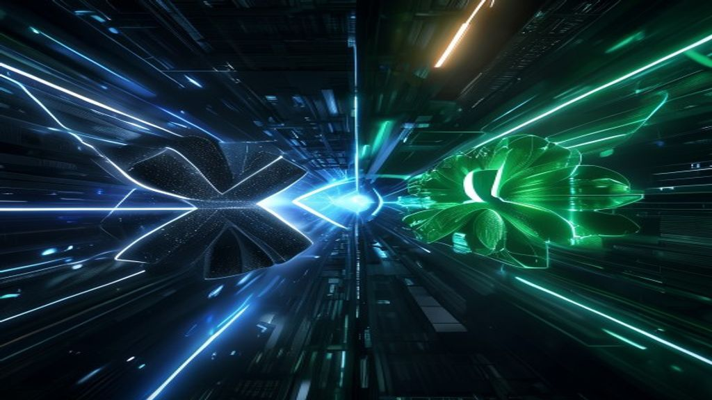

# صراع الجبابرة 2026: هل يتفوق Grok 3 من xAI على GPT-5.6 من OpenAI؟

في منتصف عام 2026، وصل مشهد الذكاء الاصطناعي إلى نقطة غليان غير مسبوقة. المعركة لم تعد تدور حول "من يستطيع كتابة قصيدة أفضل"، بل حول "من يمتلك النموذج الأقوى للبحث العلمي، وحل المعادلات الرياضية المعقدة، والوصول الآني المفتوح للمعلومات الحية". في قلب هذا الصراع يقف عملاقان: **OpenAI** بنموذجها الأحدث والأقوى **GPT-5.6**، و **xAI** بقيادة إيلون ماسك مع نموذجها المدمر **Grok 3** المدعوم بأكبر حاسوب عملاق في العالم.

في هذه المقالة، سنضع كلا النموذجين تحت المجهر في مقارنة شاملة وعميقة. سنستعرض القدرات التقنية، بنية الحوسبة التي تقف خلفهما، أيهما يقدم استدلالاً حقيقياً (True Reasoning)، ومن سيشكل مستقبل الذكاء الاصطناعي التوليدي.

## ما الفرق الرئيسي بين Grok 3 و GPT-5.6؟
الفرق الجوهري يكمن في **الفلسفة وبيانات التدريب**: يركز **GPT-5.6** من OpenAI على "الاستدلال المنهجي العميق" (Deep Tiered Reasoning) حيث يأخذ النموذج وقته للتفكير في المهام المعقدة وتقديم إجابات مدروسة وآمنة تماماً بفضل التوجيه الدقيق (RLHF). في المقابل، يركز **Grok 3** من xAI على "الوصول اللحظي المفتوح للمعلومات" عبر اندماجه مع منصة X (تويتر سابقاً)، ويتميز بـ "التمرد" وغياب القيود الصارمة (Anti-woke AI)، مدعوماً بقوة حوسبة خام لا مثيل لها بفضل حاسوب "Colossus" العملاق في ممفيس.

## 1. سباق الحوسبة: معركة الـ GPUs

الذكاء الاصطناعي في 2026 هو بالأساس لعبة أرقام وحوسبة. مَن يمتلك السيليكون يحكم العالم.

### حاسوب Colossus (خلف Grok 3)
قامت شركة xAI بتجميع أقوى عنقود حاسوبي (Compute Cluster) تم تسجيله في تاريخ البشرية حتى الآن، والمعروف باسم "Colossus". هذا الحاسوب يضم أكثر من 100,000 وحدة معالجة رسوميات من طراز Nvidia H100s، وبحلول منتصف 2026 تم ترقيته بـ 50,000 وحدة إضافية من جيل H200 و B200 الأحدث. قوة الحوسبة الغاشمة هذه سمحت لـ Grok 3 بإنهاء فترة تدريبه في وقت قياسي وبحجم معلمات (Parameters) يجعله من أضخم النماذج على الإطلاق.

### شراكة Microsoft و OpenAI (خلف GPT-5.6)
OpenAI لا تعتمد على حاسوب مركزي واحد، بل تستند إلى بنية Azure السحابية الموزعة من مايكروسوفت والتي تُقدر قيمتها بعشرات المليارات من الدولارات. ما يميز بنية OpenAI هو التركيز على "كفاءة التدريب" وبنية الخبراء المتعددين (Mixture of Experts - MoE) المتقدمة للغاية، والتي تسمح للنموذج بتشغيل أجزاء محددة فقط من الشبكة العصبية لتوفير الطاقة وتقليل زمن الوصول (Latency).

## 2. الاستدلال العميق (Deep Reasoning) مقابل تدفق البيانات

هنا نجد الاختلاف الأكبر في كيفية معالجة كل نموذج للطلبات المعقدة:

### نهج OpenAI: التفكير قبل التحدث
مع سلسلة GPT-5.6 (والتي تطورت من مشاريع o1 و Q-Star)، طبقت OpenAI مفهوم "وقت التفكير" (Thinking Time). عندما تسأل GPT-5.6 سؤالاً معقداً في الرياضيات أو البرمجة، فإنه لا يبصق الإجابة فوراً. بدلاً من ذلك، يدخل في حلقة تفكير مخفية، يختبر فيها عدة فرضيات، يصحح أخطاءه، ثم يقدم لك النتيجة النهائية. هذا النهج يجعله **النموذج الأقوى بلا منازع** في حل المشكلات الأكاديمية والبرمجية المعقدة.

### نهج xAI: النبض الحي للإنترنت
Grok 3 لا يقضي وقتاً طويلاً في حلقات التفكير البطيئة، بل يعتمد على "الوعي اللحظي" (Real-time Awareness). النموذج متصل مباشرة بأنبوب بيانات منصة X، مما يجعله الأداة الأسرع في العالم لمعرفة الأخبار العاجلة، قراءة اتجاهات السوق (Market Trends)، وتحليل الرأي العام في الزمن الفعلي. إذا سألت Grok 3 عن حدث وقع قبل 5 دقائق، سيعطيك تحليلاً دقيقاً مع الروابط من التغريدات المباشرة.

## 3. الرقابة والأمان (Safety vs Freedom)

لطالما كان هذا هو محور النزاع الفلسفي بين إيلون ماسك وسام ألتمان.

* **GPT-5.6 (الأمان المؤسسي):** تم تصميم هذا النموذج بعناية فائقة ليكون مناسباً للشركات الكبرى والبنوك والوكالات الحكومية. يخضع النموذج لاختبارات أمان صارمة (Red Teaming) تمنعه من توليد محتوى ضار، أو اتخاذ مواقف سياسية حادة، أو الانحياز الواضح. هذا يجعله آمناً، ولكنه قد يبدو "مقيّداً" أو "مفرط الحساسية" لبعض المستخدمين المبدعين.
* **Grok 3 (حرية التعبير بجرأة):** يفتخر Grok 3 بأنه "غير مقيد" ويوفر وضع الـ "Fun Mode". النموذج مستعد لمناقشة المواضيع الجدلية بحرية، لا يرفض الطلبات بسهولة، ويمتلك حس دعابة ساخر (Sarcasm) يميزه عن النبرة الآلية لباقي النماذج. ومع ذلك، هذه الحرية تجعله أقل جاذبية للشركات الكبرى التي تخشى من الهلوسة الخطرة (Dangerous Hallucinations).

## 4. الميزات والأداء في الاستخدام اليومي

دعونا نقارن بين النموذجين في المهام اليومية للمستخدمين والمطورين:

| المهمة | الفائز | السبب |
| :--- | :--- | :--- |
| **البرمجة المعقدة وهندسة النظم** | **GPT-5.6** | بفضل قدرات الاستدلال المتدرج وقدرته على استيعاب مستودعات كود كاملة وتوقع الأخطاء قبل حدوثها. |
| **تحليل الأخبار العاجلة والأسواق** | **Grok 3** | الوصول الحصري والمباشر لبيانات منصة X يعطيه أفضلية لا يمكن لـ OpenAI منافستها حالياً. |
| **الكتابة الإبداعية وتوليد الأفكار** | **تعادل** | GPT-5.6 يقدم هيكلة أفضل للمقالات الطويلة، بينما Grok 3 يقدم نصوصاً أكثر حيوية وأقل آلية. |
| **الرؤية وتحليل الصور (Vision)** | **GPT-5.6** | دقة تفاصيل محرك الرؤية الخاص بـ OpenAI يتفوق في تحليل الرسوم البيانية الطبية والصور المعقدة. |
| **تسعير واجهة برمجة التطبيقات (API)** | **Grok 3** | تقدم xAI أسعاراً تنافسية وشرسة جداً (أقل تكلفة بكثير) لجذب المطورين بعيداً عن OpenAI. |

## 5. لمن تذهب الغلبة؟

المنافسة في عام 2026 لم تعد تحدد بـ "النموذج الأفضل بشكل مطلق"، بل "النموذج الأنسب للمهمة". 

OpenAI حولت GPT-5.6 إلى أداة عمل جادة (Productivity Engine) وأدمجتها في صميم أنظمة تشغيل شركائها (مثل Apple و Microsoft). إذا كنت تبني تطبيقاً يعتمد على التحليل المنطقي العميق ولا يمكنك المخاطرة بإجابات غير متوقعة، فإن **GPT-5.6 هو المعيار الذهبي**.

من ناحية أخرى، إيلون ماسك نجح في وضع **Grok 3** في جيب كل صانع محتوى وباحث عن المعلومات غير المفلترة. اندماج النموذج مع X يجعله وكيل أخبار لا ينام، وقوة الحوسبة الهائلة خلفه تضمن أنه لن يتأخر أبداً في اللحاق بأحدث قدرات الذكاء الاصطناعي.

## Hussein's Take

  
💬

  

    <h4 style="margin:0 0 6px;color:var(--text-primary);font-size:.95rem;font-weight:700;">HUSSEIN'S TAKE</h4>
    
الصراع بين Grok 3 و GPT-5.6 يمثل أكثر من مجرد تنافس تقني؛ إنه صدام بين عقليتين. OpenAI تمثل نهج "السياج المحكم" (Walled Garden)، حيث النموذج هو مساعد مكتب آمن وموثوق وممل بعض الشيء. بينما يمثل إيلون ماسك وفريق xAI نهج "القوة الخام" (Brute Force)، حيث الأولوية للسرعة والبيانات الحية المباشرة حتى لو كانت فوضوية. كمطور، أجد نفسي أستخدم GPT-5.6 لكتابة الكود وبناء الهياكل البرمجية المعقدة لأنه يقلل الأخطاء. ولكن عندما أريد تحليل تريند معين على السوشيال ميديا أو الحصول على رأي حول حدث وقع للتو، فإن Grok 3 هو أداتي الوحيدة. الفائز الحقيقي هنا هو المستخدم الذي يمكنه الجمع بين قدرات الاثنين معاً.

  

## الخلاصة

لقد أثبت إصدار **Grok 3** في 2026 أن شركة xAI لم تعد مجرد "مشروع جانبي" لإيلون ماسك، بل هي منافس قادر على إزعاج هيمنة **OpenAI** و نموذجها **GPT-5.6**. وفي حين يظل نموذج سام ألتمان متسيداً في مهام الاستدلال المعقد وتطبيقات الشركات (B2B)، حفر Grok 3 اسمه كأقوى ذكاء اصطناعي للمعلومات الحية والمستخدمين الباحثين عن الحرية (B2C). المعركة القادمة ستكون حول من يستطيع تقديم وكلاء ذكاء اصطناعي مستقلين (Autonomous Agents) يمكنهم أداء المهام بالكامل نيابة عن المستخدم، وهو ما نراقبه عن كثب.

## الأسئلة الشائعة (FAQ)

**هل يمكنني استخدام Grok 3 مجاناً؟**
الوصول الكامل إلى إمكانيات Grok 3 متاح حصرياً للمشتركين في باقة X Premium، بينما توفر OpenAI وصولاً مجانياً (ومحدوداً) إلى نسخ مخففة من نماذجها.

**هل Grok 3 أفضل في البرمجة من GPT-5.6؟**
على الرغم من تحسنه الهائل، لا يزال GPT-5.6 (ونماذج o1) يتفوقون في مهام البرمجة المتقدمة وحل المشكلات الهندسية المعقدة بسبب ميزة التفكير المخفي (Hidden reasoning).

**لماذا يعتبر حاسوب Colossus الخاص بـ xAI مميزاً؟**
لأنه أكبر تجمع لشرائح الذكاء الاصطناعي في موقع واحد في العالم (أكثر من 150,000 شريحة Nvidia H100 و B200)، مما يمنح xAI القدرة على تدريب النماذج الجديدة في أسابيع بدلاً من شهور.

لمزيد من التحليلات المعمقة، اطلع على [كيف أعادت OpenAI تشكيل استراتيجية النماذج المتدرجة في 2026](openai-releases-gpt-5-6-sol-tiered-reasoning-models-2026.html).
